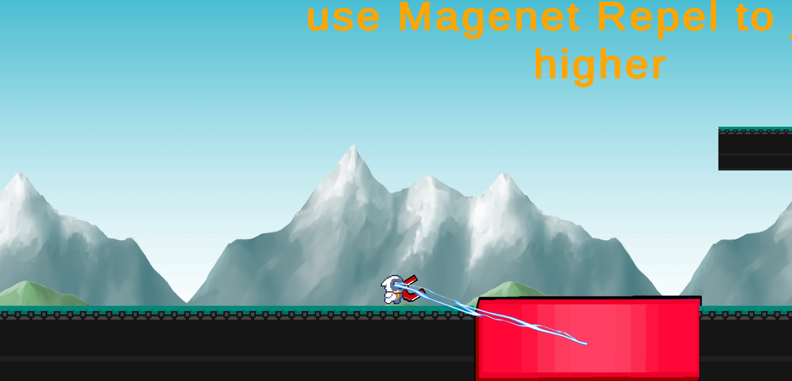

# Magman

## Game Idea
A Unity platform game in which the player uses magnetism (attract or repel) to overcome obstacles and reach the end. Magnets of the same color repel each other, while magnets with different colors attract each other. 

### Mechanism
A/D: Movement (left/right)
 
Space: Jump/Double Jump
 
E: Drop magnet

### Features
* Pick up/drop off magnets.
* Repulsion between magnets with the same color.
* Attraction between magnets with different colors.
* Magzone where jump makes character float in the air.
* Animation, background music, level design.
* Legacy analytics to track player statistics.

## Team Member
Difan Xue: difanxue@usc.edu
 
Xin Chen: xchen724@usc.edu
 
Bowen Jia: jiab@usc.edu
 
Kaiyuan Yu: kaiyuany@usc.edu
 
Tianhao Yang: tyang955@usc.edu
 
Zhengchun Zhao: zzhao400@usc.edu
 
Jiayuan Bi: jiayuanb@usc.edu
 
Chongjian Tang: tangchon@usc.edu
 
Carra Hamner: carrah@usc.edu
 
Di Wen: diwen@usc.edu
 
Yinghao Li: yli96468@usc.edu
 

## Links
### Playable URL
https://play.unity.com/mg/other/magman-0j
### Final Presentation Video
https://youtu.be/qFxc3-sGSSs
## Snapshot

